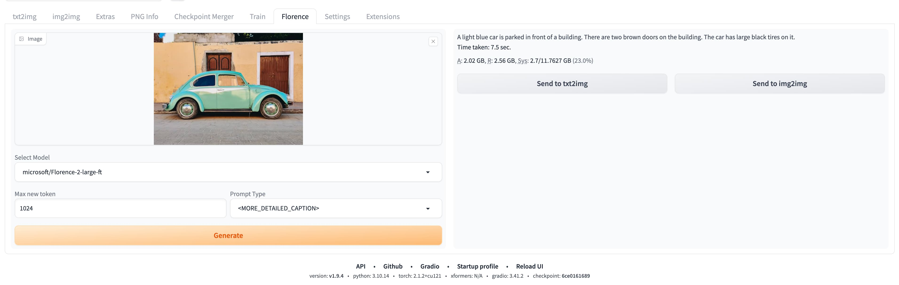

# sd-webui-florence-2

[中文](README.md) **|** [English](README_EN.md)

**sd-webui-florence-2** 能够解析并反推出图片中的内容

# 安装

> 视频教程: [https://www.bilibili.com/video/BV1JV8fePE6M/](https://www.bilibili.com/video/BV1JV8fePE6M/)

1. Extensions -> Install from URL -> Enter URL of this repository -> Press Install button or clone this repository under extensions/

```
git clone https://github.com/ilyq/sd-webui-florence-2 extensions/sd-webui-florence-2
```

# 重要说明

1. transformers 版本

   1.1. 旧版本 transformers 不支持 Florence-2, 旧版本会出现以下报错:

   ```
   TypeError: Object of type Florence2LanguageConfig is not JSON serializable
   ```

   1.2. Automatic1111's Web UI 在 requirements.txt 和 requirements_versions.txt 文件中指定了 transformers 的旧版本 4.30.2.  
   1.3. 更新 Transformers 版本可能会引发其他错误，请自行测试

2. 模型保存目录: `models/florence2`

# Screenshot



# 参考

[https://huggingface.co/microsoft/Florence-2-large](https://huggingface.co/microsoft/Florence-2-large)
