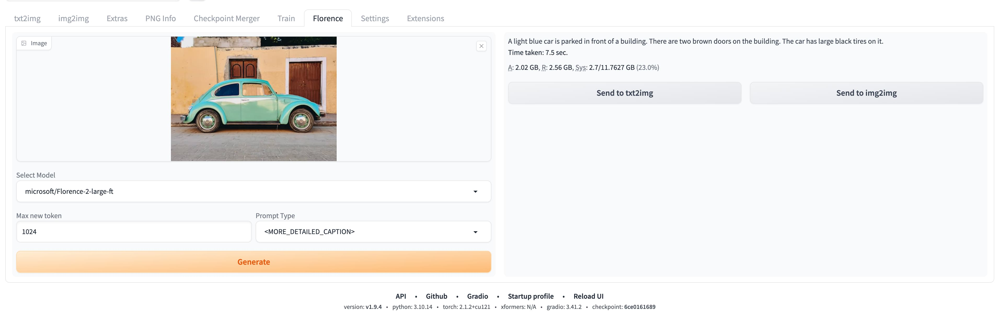

# sd-webui-florence-2

[中文](README.md) **|** [English](README_EN.md)

**sd-webui-florence-2** can identify the content of images and describe them in natural language.

# Installation

> video: [https://www.bilibili.com/video/BV1JV8fePE6M/](https://www.bilibili.com/video/BV1JV8fePE6M/)

1. Extensions -> Install from URL -> Enter URL of this repository -> Press Install button or clone this repository under extensions/

```
git clone https://github.com/ilyq/sd-webui-florence-2 extensions/sd-webui-florence-2
```

# Important Notice

1. transformers version

   1.1. Old versions of transformers do not support Florence-2, and using them will result in the following error:

   ```
   TypeError: Object of type Florence2LanguageConfig is not JSON serializable
   ```

   1.2. Automatic1111's Web UI specifies an older version of transformers, 4.30.2, in the requirements.txt and requirements_versions.txt files.  
   1.3. Updating the Transformers version may trigger other errors; please test it yourself.

2. flash-attn

   2.1. Flash-attn has been installed successfully, but an error occurred during runtime.

   ```
   ImportError: This modeling file requires the following packages that were not found in your environment: flash_attn. Run `pip install flash_attn`
   ```

   2.2. reference: [https://gist.github.com/ashmalvayani/b4dee2084ffac9dbddc5dd32353448d3](https://gist.github.com/ashmalvayani/b4dee2084ffac9dbddc5dd32353448d3)

3. model path: `models/florence2`

# Screenshot



# Reference

[https://huggingface.co/microsoft/Florence-2-large](https://huggingface.co/microsoft/Florence-2-large)
